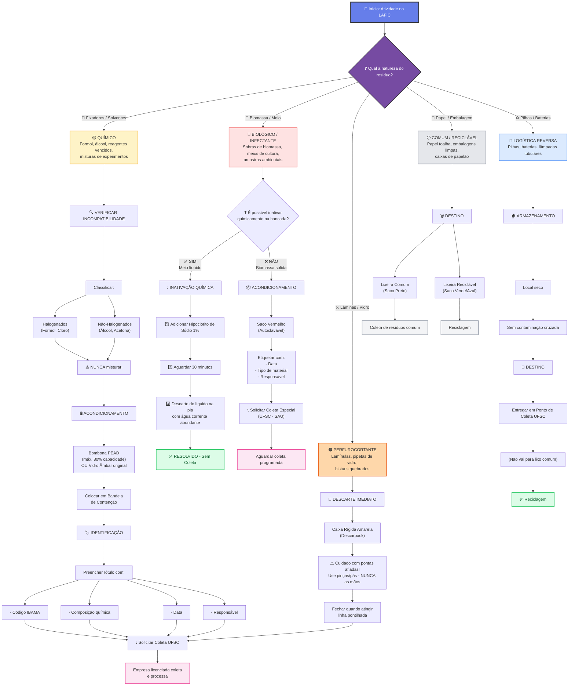

# 🌳 Árvore de Decisão - PGRS LAFIC

## Fluxograma Completo de Classificação



---

## 📋 Tabela de Decisão Rápida

| **Resíduo** | **Origem** | **Decisão** | **Acondicionamento** | **Ação Final** | **Código IBAMA** |
|-------------|-----------|-----------|---------------------|----------------|-----------------|
| 🔴 **Biomassa / Meio Cultura** | Experimento | Inativar quimicamente? | Saco Vermelho (se não) | Coleta Especial | N/A |
| 🟡 **Fixador (Formol)** | Descarte | Verificar incompatibilidade | Bombona PEAD | Coleta UFSC | Sim |
| 🟡 **Álcool / Solvente** | Descarte | Verificar incompatibilidade | Bombona PEAD | Coleta UFSC | Sim |
| 🟠 **Lâmula / Vidro Quebrado** | Limpeza | Descarte imediato | Caixa Rígida Amarela | Coleta UFSC | Sim |
| 🔵 **Pilhas / Baterias** | Equipamento | Armazenar seco | Local próprio | Ponto de Coleta | Não |
| ⚪ **Papel Toalha Limpo** | Limpeza | Reciclar | Saco Branco/Verde | Coleta Comum | Não |

---

## 🎯 Pontos Críticos de Decisão

### 🔴 FLUXO BIOLÓGICO - Decisão Principal: "Inativar Quimicamente?"

**✅ SIM se:**
- Meio de cultura líquido
- Solução aquosa
- Sem biomassa sólida complexa
- Passível de tratamento com hipoclorito

**❌ NÃO se:**
- Biomassa sólida (algas, cells precipitadas)
- Meios muito complexos
- Vidro ou plástico contaminado
- Incerteza sobre composição

**Quando SIM: Protocolo Rápido (30 min)**
```
1. Medir volume (máx. 1L por vez em erlenmeyer)
2. Adicionar Hipoclorito 1% (10 mL por 100 mL)
3. Deixar em repouso 30 minutos
4. Descartar na pia com água corrente
5. Lavar erlenmeyer e deixar secar
```

**Quando NÃO: Protocolo de Armazenamento**
```
1. Etiquetar saco vermelho
2. Armazenar em local designado
3. Solicitar coleta quando cheio
4. Recepção SAU coleta em 48h
```

---

### 🟡 FLUXO QUÍMICO - Decisão Principal: "Compatibilidade"

**Halogenados:** Formol, Cloro, Iodo, Bromo
- ❌ NUNCA misturar com Não-Halogenados
- 📦 Bombona separada
- 🏷️ Rótulo em VERMELHO

**Não-Halogenados:** Álcool, Acetona, Tolueno
- ❌ NUNCA misturar com Halogenados
- 📦 Bombona separada
- 🏷️ Rótulo em AZUL

**Código IBAMA:**
- **3001.32.00** - Resíduos de formol
- **3001.33.00** - Resíduos de solventes halogenados
- **3001.34.00** - Resíduos de solventes não-halogenados

---

### 🟠 FLUXO PERFUROCORTANTE - Sem Decisão

**Sempre:** Descarte Imediato na Caixa Rígida Amarela

⚠️ **Segurança:**
- Use **PINÇAS** ou **PÁ** - NUNCA as mãos
- Deposite vidro quebrado em saco pequeno antes de colocar na caixa
- Avise coordenador se houver muito vidro/biomassa

---

### 🔵 FLUXO LOGÍSTICA REVERSA - Decisão: "Identificar Local de Coleta"

**Pilhas / Baterias:**
- Local: Sala de reuniões (caixa verde)
- Coleta: Trimestral

**Lâmpadas Tubulares:**
- Local: Almoxarifado
- Coleta: Semestral

---

### ⚪ FLUXO COMUM - Sem Decisão Técnica

**Papel Toalha / Embalagens Limpas:**
- Saco Branco (lixo comum)
- Coleta semanal

**Recicláveis (Caixas, Plástico limpo):**
- Saco Azul/Verde
- Coleta semanal

---

## 💾 Implementação no Aplicativo

Este fluxograma será:
1. ✅ Visualizado como diagrama Mermaid no GitHub
2. ✅ Referência para o formulário inteligente
3. ✅ Printável para afixar no laboratório
4. ✅ Incorporado no app.html como guia interativo

---

**Próxima Etapa:** Integrar esta árvore de decisão ao formulário do app para orientar passo a passo!
