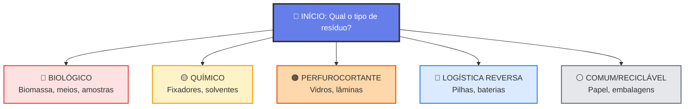
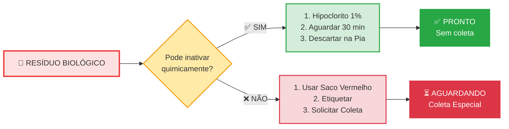
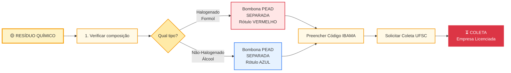
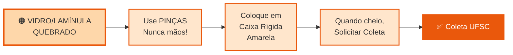
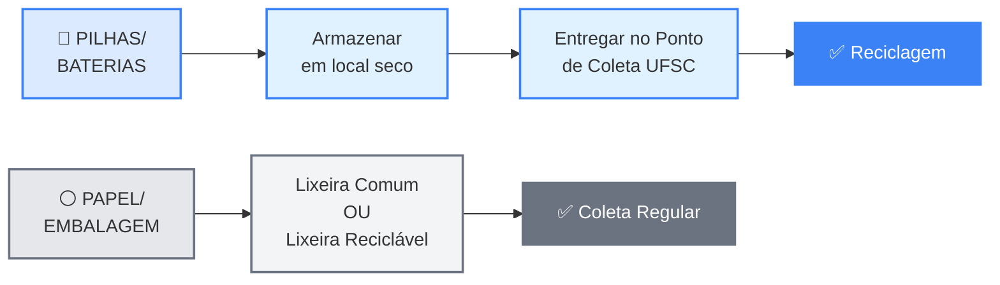

# 🌳 Árvore de Decisão SIMPLIFICADA

## Versão 1: Diagrama Principal Limpo

---

## Versão 2: Fluxo BIOLÓGICO Detalhado

---

## Versão 3: Fluxo QUÍMICO Detalhado

---

## Versão 4: Fluxo PERFUROCORTANTE (Simples!)

---

## Versão 5: Fluxo LOGÍSTICA & COMUM (Simples!)

---

## 📋 TABELA RESUMIDA (Mais Fácil!)

| Tipo | Decisão? | Ação 1 | Ação 2 | Ação 3 | Destino |
|------|----------|--------|--------|--------|---------|
| 🔴 **BIOLÓGICO** | ❓ Inativar? | SIM: Hipoclorito 1% | Aguardar 30 min | Pia c/ água | ✅ Pronto |
| 🔴 **BIOLÓGICO** | ❓ Inativar? | NÃO: Saco Vermelho | Etiquetar | Solicitar Coleta | ⏳ Coleta |
| 🟡 **QUÍMICO** | ❓ Compatível? | Bombona PEAD | Código IBAMA | Solicitar Coleta | ⏳ Coleta |
| 🟠 **PERFURO** | ❌ Não | Pinças (nunca mãos) | Caixa Amarela | Solicitar Coleta | ⏳ Coleta |
| 🔵 **LOGÍSTICA** | ❌ Não | Local Seco | Ponto de Coleta | Entregar | ✅ Reciclado |
| ⚪ **COMUM** | ❌ Não | Lixeira Branca | - | - | ✅ Coleta |

---

## 🎯 QUAL VERSÃO É MELHOR?

### Para App.html (Modal):
**Use Versão 1** (Diagrama Principal)
- Simples e claro
- Mostra os 5 caminhos

### Para Laboratório (Impressão):
**Use Versão 2, 3, 4, 5** (Separadas por fluxo)
- Uma impressão por tipo de resíduo
- Menos confuso
- Fácil de lembrar

### Para Referência Rápida:
**Use Tabela Resumida**
- Tudo em uma página
- Praticamente

---

## ✅ Qual você prefere?

1. **Manter simplificado** (Versão 1 no app)
2. **Usar multi-diagramas** (Versões 2-5 por tipo)
3. **Usar tabela** (Mais direto)
4. **Combinar:** Versão 1 + Tabela no app

Qual faz mais sentido para o LAFIC? 🤔
